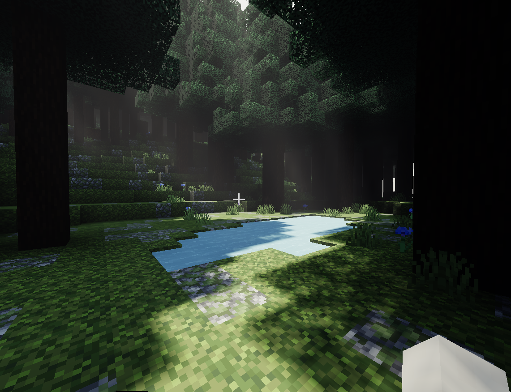
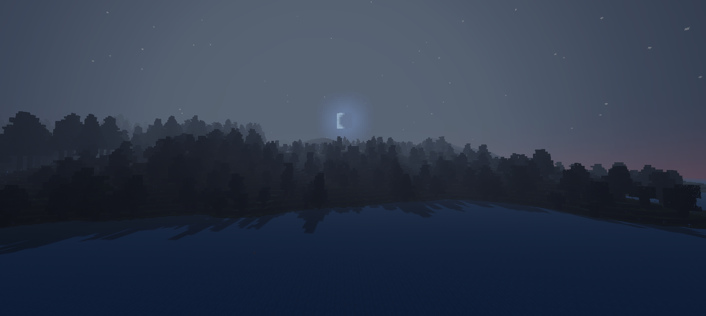

# Procedural World Gen - Script API
This project came about quite by accident. I didn't really know what to do, but I remembered a few people trying similar things in minecraft, but what's interesting about this project is that it's a bedrock edition and it's not using official world gen extension provided, it's just a scripting part that Mojang provided.

### Download Links
 - [Download Full Minecraft Addon](https://github.com/conmaster2112/procedular-world-gen-script-api/raw/main/WorldGenAddon.mcaddon)
 - [Download Behavior Pack](https://github.com/conmaster2112/procedular-world-gen-script-api/raw/main/WorldGen_BP.mcpack)
 - [Download Resource Pack PBR](https://github.com/conmaster2112/procedular-world-gen-script-api/raw/main/WorldGen_PBR_RP.mcpack)

## Creating New World
Well, there is not much to say, this version works only for latest preview which is `1.21.0.22`.

Keep this settings in mind when you creating new world.
 - Flat World
 - Max Simulation Distance
 - Beta APIs - Experimtal
 - Deferred Techincal Preview - Experimental (required when resource pack is added)

## Showcase
Here I would like to add a few gates from the generated world, this images are taken with Defered Techincal.

### Deep Forest - Mini Pool

### Deep Forest - Hill View

### Dry Land - Hay Block

### Deep Forest - Bigger Lake

### Sea - Panorama View

## Adding Own Custom Biomes
Custom biomes are just simple definitions of what grows here.
- Vegetation Brush
- Tree Brush
- Top Layer Brush
- Stone Secondary Layer Brush

I recommend you check out this file [here](./behavior_pack/scripts/my_world/biomes.js), it contains a lot of information about custom biomes.

# Debug Info
I have implemented basic command for showing debug infor while traveling. Just type "!debug" in chat.

## Libraries
I use only one library, and that is the library for noise types. Since this library contains multiple noise types, I decided to use it instead of creating my own.

Link: [FastNoiseLite](https://github.com/Auburn/FastNoiseLite)

## Open Source
This project is open source so you can use any parts of this code in your own projects, i would like to see some in-code credits in comments, but i am not forcing you.

Still, I don't want you to use that stand alone pack in any profitable program/plan.

## Contribution
This project will be archived soon, create your own forks if you want, but I'm not accepting any new pull requests